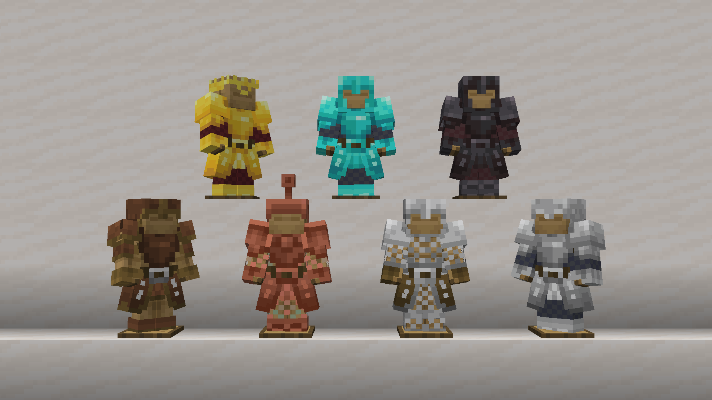
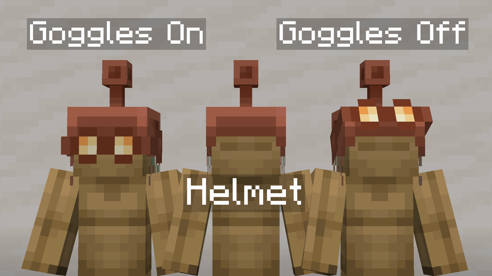
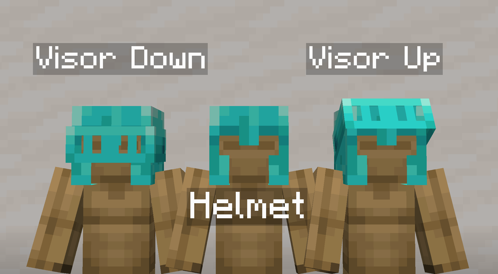
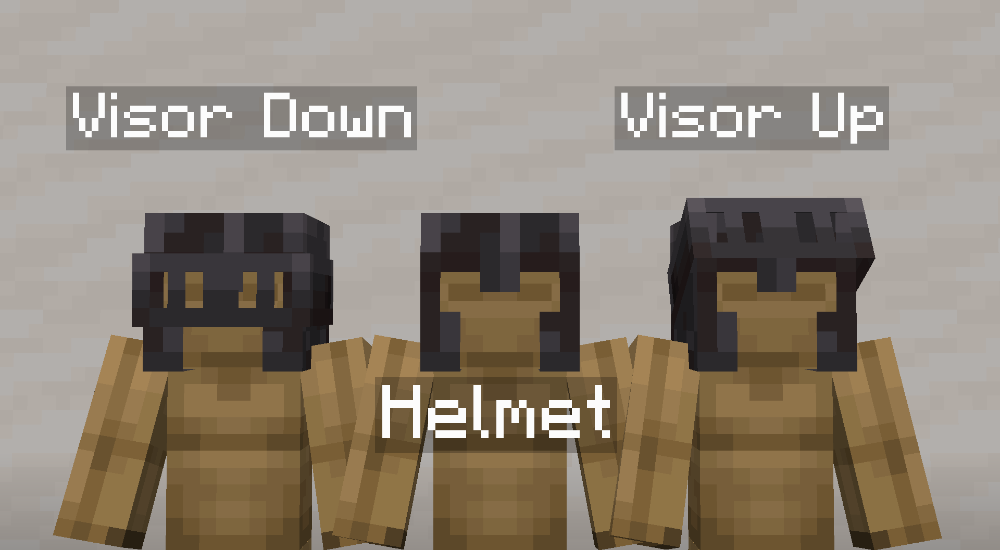

 
 

<h1 align="center">Armored Legacy Resource Pack</h1>

**Armored Legacy** is a resource pack that revamps vanilla armor, giving it a powerful new look with custom models and textures using [EMF](https://modrinth.com/mod/entity-model-features) and [ETF](https://modrinth.com/mod/entitytexturefeatures). It features vanilla-like armor trims that glow and interchangeable helmets for Copper, Diamond, and Netherite!

## 🎨 Features

### Armor Trims

Armored Legacy has fully integrated vanilla armor trims to support the custom models.

Glowing trims require versions `1.21.2` until `1.21.8` to work as intended. As of `1.21.9` and above, glowing trims are not working.

### Interchangeable Helmets

**⚠️ Important: This feature requires [Variants CIT](https://modrinth.com/mod/variants-cit) installed to work properly.**

You can change Copper, Diamond, and Netherite Helmets to change their looks.

Rename **Copper Helmet** to `Copper Goggles On` or `Copper Goggles Off`

Rename **Diamond Helmet** to `Diamond Visor Down` or `Diamond Visor Up`

Rename **Netherite Helmet** to `Netherite Visor Down` or `Netherite Visor Up`

## ⚙️ Compatibility & Usage

This pack works with versions `1.20` until the latest version.

Make sure this pack is placed **above** any other resource packs to avoid conflicts.

Resource packs that change all vanilla armor are **NOT** compatible. Mods with custom armors may require compatibility packs. If you'd like to create one, please open a thread in the [GitHub Issues page](https://github.com/mult1v4c/Armored-Legacy/issues).

As of version `1.21.9` and above, this pack is **NOT** compatible with any player animation packs such as Fresh Moves, Better Animations, etc. due to changes with vanilla armor configurations.

---

### Please also check out my other pack [Hardware Reforged](https://modrinth.com/resourcepack/hardware-reforged)! Fully compatible with Armored Legacy and is designed to be used together.

## ✅ Roadmap

There are plans to make compatibility packs for the following mods. Some made possible by fans of Armored Legacy:

- [ ] Advanced Netherite
- [ ] Gourd Guards
- [ ] Undead Unleashed
- [ ] Born in Chaos
- [ ] Twilight Forest
- [ ] Mekanism Tools
- [ ] Divine RPG
- [ ] Aquaculture 2
- [ ] Create Mod (Cardboard Armor)

Bigger mods that adds multiple armors may take a while to review and complete. Please check the [GitHub Issues page](https://github.com/mult1v4c/Armored-Legacy/issues) to know your favorite mod has been reported.

## 📝 Attribution

All models and textures in *Armored Legacy* is made by me. However, this pack is inspired and influenced by ***Armory Conglomery*** by ***lukidon*** on [Modrinth](https://modrinth.com/resourcepack/armory-conglomery) and [Curseforge](https://www.curseforge.com/minecraft/texture-packs/armory-conglomery). Check out more of their work [here](https://modrinth.com/user/lukidonu) and [here](https://www.curseforge.com/members/lukidon/projects).

Armor Stand model used in previews is [Fancy Armor Stand Resource Pack](https://modrinth.com/resourcepack/fancy-armor-stand-texture-pack).

## 🖊️ Terms of Use

This resource pack is licensed under the **Creative Commons Attribution-NonCommercial-NoDerivatives 4.0 International License (CC BY-NC-ND 4.0)**. See `LICENSE` for more information.
By downloading this resource pack, you agree to the terms below.

**With this resource pack, you may**:

- Share and redistribute the pack in any medium or format in its original, unmodified form.
- Use the pack for personal, private purposes, including making modifications for your own use.
- Use the pack in content such as videos, livestreams, or blog posts, provided that you give appropriate credit and link back to this page.

**With this resource pack, you may NOT**:

- Distribute a modified version of the pack.
- Use this pack or any part of it for commercial purposes (e.g., include in paid content, put behind download paywalls, upload in Bedrock Marketplace, etc.).
- Claim the work as your own.
- Apply legal terms or technological measures that restrict others from doing anything the license permits.

## 👋 Feedback
If you have any feedback or find any errors or corrections, please report them on the [GitHub Issues page](https://github.com/mult1v4c/Armored-Legacy/issues).

## ❤️ Support
If you appreciate the effort put into this pack, please consider supporting me on [Ko-fi](https://ko-fi.com/mult1v4c). Your support is greatly appreciated!

