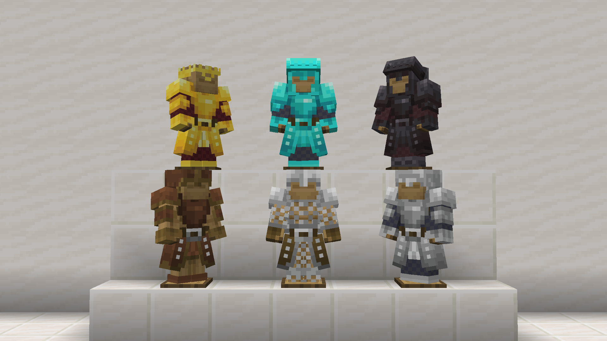
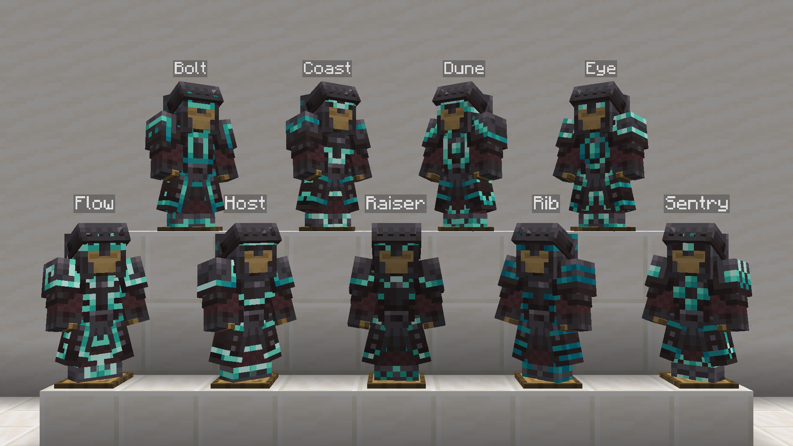
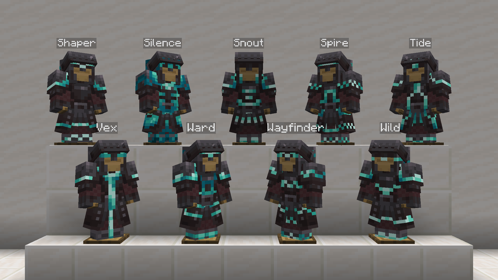
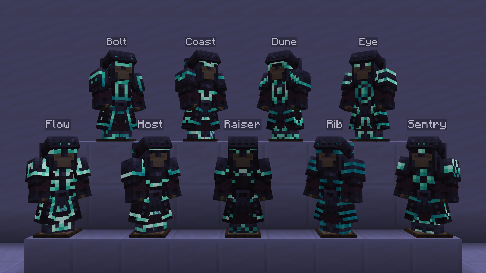
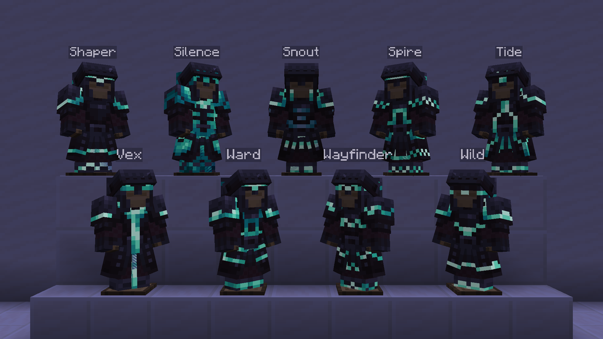
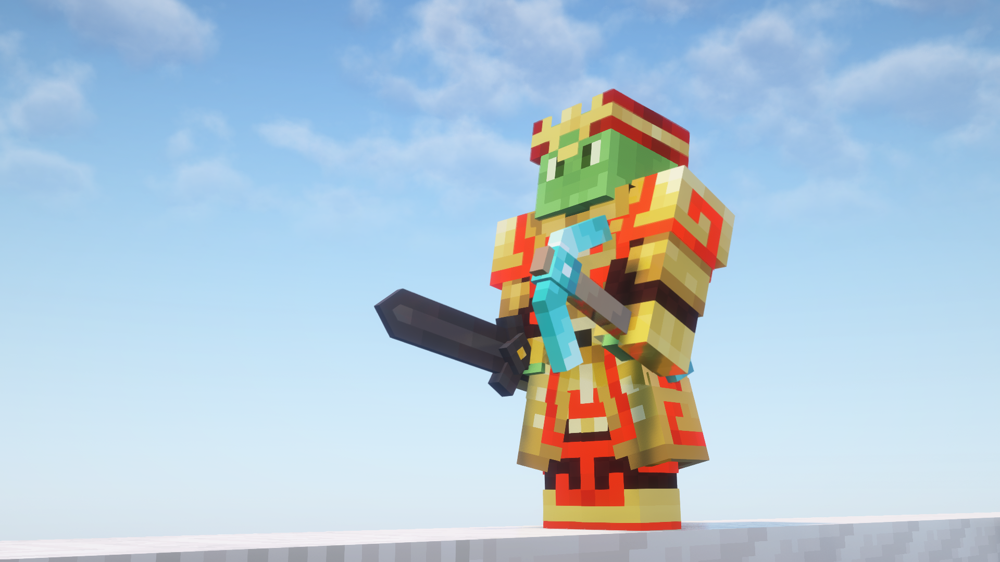

 
 

<h1 align="center">Armored Legacy Resource Pack</h1>

**Armored Legacy** is a resource pack that revamps vanilla armor, giving it a powerful new look with custom models and textures using [EMF](https://modrinth.com/mod/entity-model-features) and [ETF](https://modrinth.com/mod/entitytexturefeatures). It is compatible with animation resource packs and also features glowing armor trims that are compatible with shaders.

## ⚙️ Compatibility & Usage
This pack requires versions `1.21.2` and above to work as intended with [EMF](https://modrinth.com/mod/entity-model-features) and [ETF](https://modrinth.com/mod/entitytexturefeatures) installed.

Resource packs that change all vanilla armor are **NOT** compatible. Mods with custom armors may require compatibility packs. If you'd like to create one, please open a thread in the [GitHub Issues page](https://github.com/mult1v4c/Armored-Legacy/issues).

Make sure this pack is placed **above** any other resource packs to avoid conflicts.

### Please also check out my other pack [Hardware Reforged](https://modrinth.com/resourcepack/hardware-reforged)! Fully compatible with Armored Legacy and is designed to be used together.

## ❗Known Issues

Emissive trims do not work for `1.21.1` and below.

## 📝 Attribution

All models and textures in *Armored Legacy* is made by me. However, this pack is inspired and influenced by ***Armory Conglomery*** by ***lukidon*** on [Modrinth](https://modrinth.com/resourcepack/armory-conglomery) and [Curseforge](https://www.curseforge.com/minecraft/texture-packs/armory-conglomery). Check out more of their work [here](https://modrinth.com/user/lukidonu) and [here](https://www.curseforge.com/members/lukidon/projects).

## 🖊️ Terms of Use

This resource pack is licensed under the **Creative Commons Attribution-NonCommercial-NoDerivatives 4.0 International License (CC BY-NC-ND 4.0)**. See `LICENSE` for more information.
By downloading this resource pack, you agree to the terms below.

**With this resource pack, you may**:

- Share and redistribute the pack in any medium or format in its original, unmodified form.
- Use the pack for personal, private purposes, including making modifications for your own use.
- Use the pack in content such as videos, livestreams, or blog posts, provided that you give appropriate credit and link back to this page.

**With this resource pack, you may NOT**:

- Distribute a modified version of the pack.
- Use this pack or any part of it for commercial purposes (e.g., include in paid content, put behind download paywalls, upload in Bedrock Marketplace, etc.).
- Claim the work as your own.
- Apply legal terms or technological measures that restrict others from doing anything the license permits.

## 👋 Feedback
If you have any feedback or find any errors or corrections, please report them on the [GitHub Issues page](https://github.com/mult1v4c/Armored-Legacy/issues).

## ❤️ Support
If you appreciate the effort put into this pack, please consider supporting me on [Ko-fi](https://ko-fi.com/mult1v4c). Your support is greatly appreciated!

